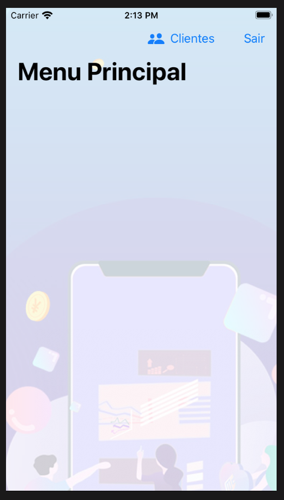
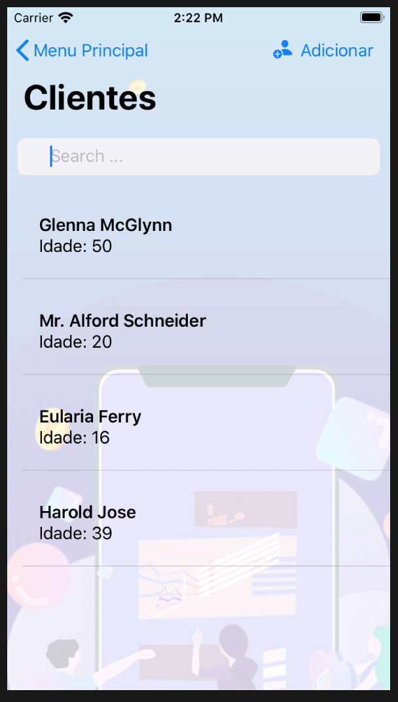
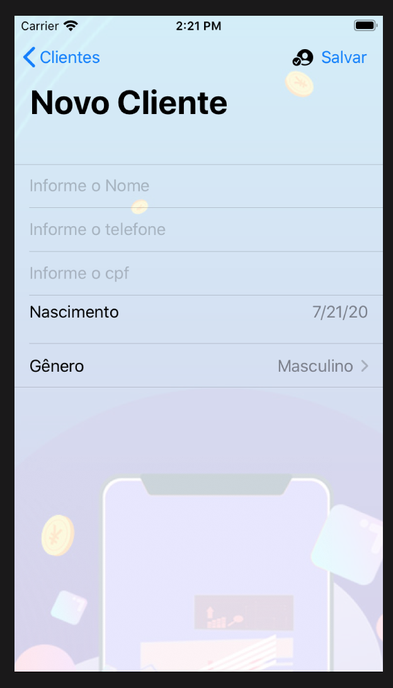

# ios-swiftui-crud
  Projeto de estudos/teste de CRUD usando SwiftUI e Combine
  
  
# Tecnologias / Arquitetura utilizada
- SwiftUI
- Combine Framework
- MVVM Pattern
- Repository Pattern
- Api Mockadas em https://www.mockapi.io/

# TODO: Melhorias a serem desenvolvidas neste estudo

- Finalizar as operacoes de Alteracao e Deleção
- Adicionar loading durante as requisicoes
- Melhoria de Design

- Adicionar Injecao de Dependencia
- Adicionar Testes automatizados
- Adicionar Telas com UIKit para verificar como deve funcionar em conjunto com SwiftUI
- Adicionar Telas com UIKit para ser utilizado com um componente SwiftUI e tambem o inverso

# Telas

| Tela Principal  | Listagem de Clientes | Formulario de Cliente |
| ------------- | ------------- | ------------- |
|   |  | 

